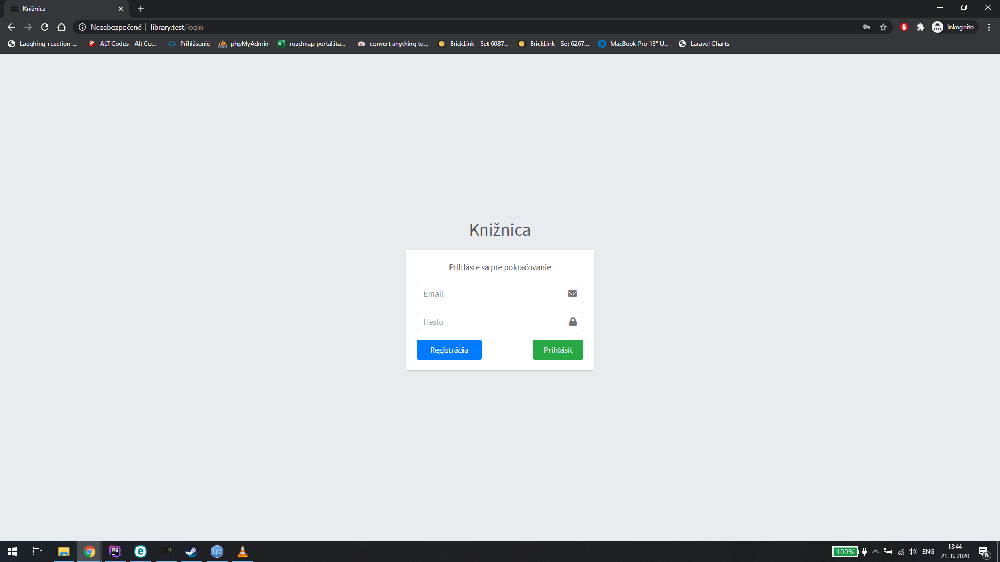

# Library

A simple website where a user (owner of a library) can manage books and authors, and create relationships between them. Project was made using Laravel 7 and Admin Panel v3 as a theme.

## Installation

Clone this repository and run prepared migrations and seeds.

## Screenshots

